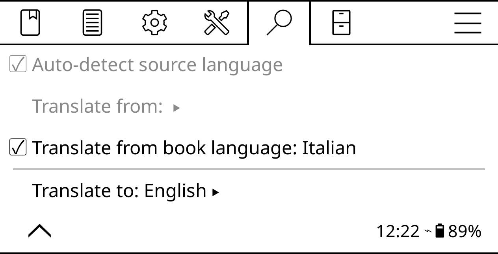

# Select translation language

In theory, the translation feature in KOReader is supposed to automatically detect the source language. But often it identifies languages incorrectly. To solve the problem, open the top bar, switch to **Lookup -> Translation settings**, and set **Translate from book language** to the desired language.