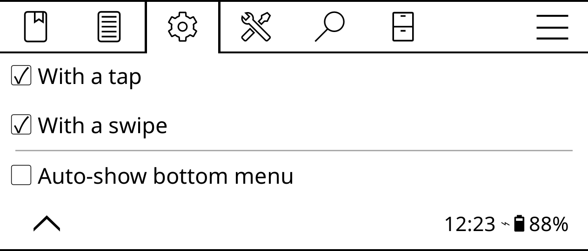

# Disable auto-show bottom menu

By default, activating the top bar also opens the bottom menu. It's meant as a convenience, but in most cases, it quickly becomes a nuisance. To disable this option, open the top bar, choose **Settings -> Taps and gestures -> Activate menu** and disable the **Auto-show bottom menu** option.