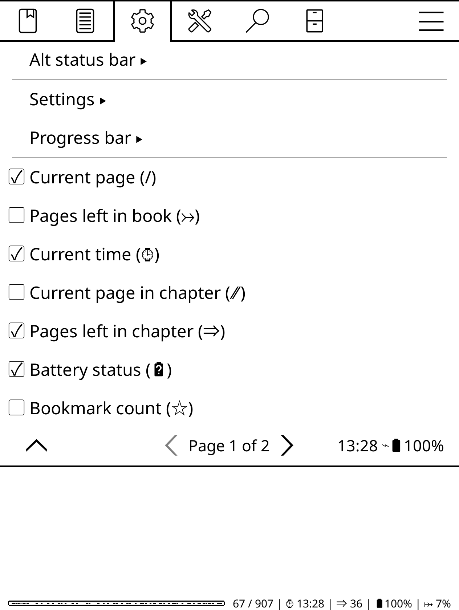

# Customize the status bar

By default, you can cycle through the available views by tapping on the status var. But you can also squeeze all the information you find useful into a single view. 

To do this, open the top bar, choose **Settings -> Status Bar -> Settings**, and enable the **Show all at once** option. Return to the **Settings -> Status Bar** menu and toggle the desired options.