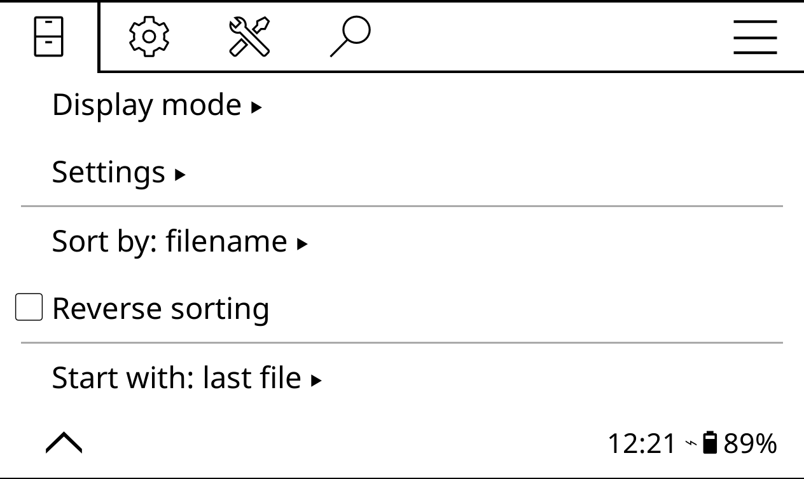

# Open with the last viewed book

By default, when you launch KOReader, it opens the file manager.

To make it start with the last viewed book, open the top bar and switch to the file manager. Tap on the top header to open the main menu, switch to the file manager section, and select **Start with -> Start with last file**.