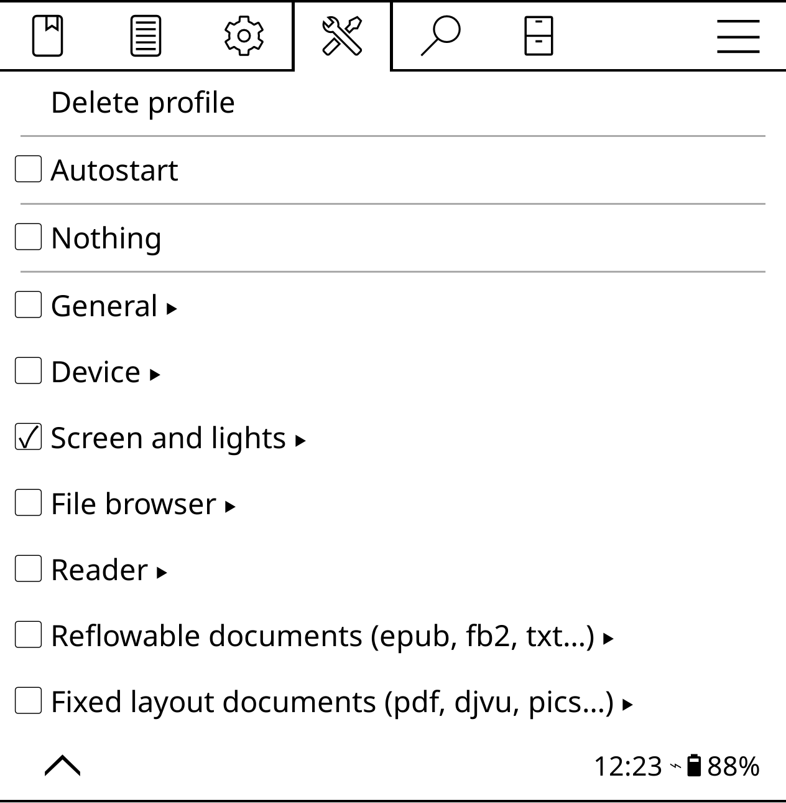

# Profiles

Using the profiles, you can create multiple reading configurations and quickly switch between them. For example, you can create a dedicated profile for night reading, with specific frontlight settings (brightness and color temperature), night mode enabled, etc. And you can create a daytime profile with both the frontline and night mode off. To create a profile, open the top bar and choose **Tools -> Profiles -> New**, configure the desired settings, and you are done. To enable the created profile, long-tap on it.