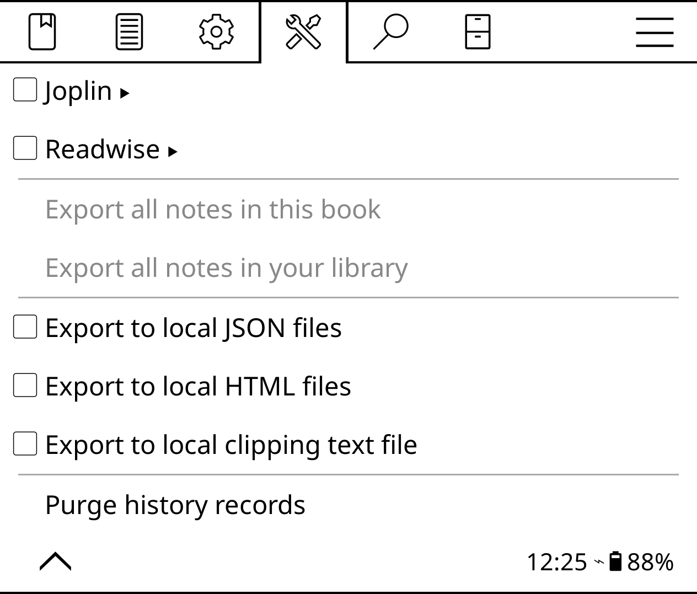

# Export highlights

KOReader makes it easy to export all your notes and hightlights. Open the top bar, choose **Tools -> Export highlights**, choose the desired format, then export all notes from the currently opened book or from the entire library.