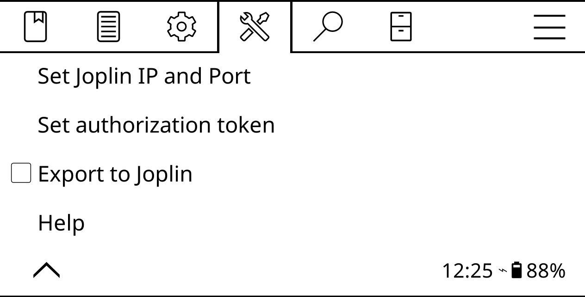

# Export highlights to Joplin

In addition to exporting highlights as HTML, JSON, and plain text files, KOReader can also push notes from the e-reader directly to the [Joplin](https://joplinapp.org) note-taking application. The initial setup process requires some work, but once it's done, pushing notes to Joplin is easy.

First step is to configure Joplin. Launch the application, choose **Tools -> Options**, and switch to the **Web clipper** section. Press **Enable Web Clipper Service** and copy the automatically generated authorization token. Leave Joplin running. If you use Joplin on a Linux machine, install the _socat_ package. To do this on Ubuntu and Linux Mint, run the `sudo apt install socat` command.

Connect your e-reader to the machine, enable **Start USB storage** in KOReader, and open the _koreader/settings.reader.lua_ file for editing. Locate the `["exporter"]` section and add the following entries to it (replace _127.0.0.1_ with the actual IP address of the machine running Joplin, and replace _authorization_token_ with the copied token):

```yaml
["joplin_IP"] = "127.0.0.1",
["joplin_token"] = "authorization_token",
["joplin_port"] = 41185,
["joplin_export"] = true,
```

Save the changes and safely disconnect the e-reader. On the machine running Joplin, open the terminal, and run the following command:

```
socat tcp-listen:41185,reuseaddr,fork tcp:localhost:41184
```



In KOReader, open the top bar, choose **Tools -> Export highlights**, make sure the **Joplin** option is enabled, and tap either **Export all notes in this book** or **Export all notes in your library**.

Source: <https://www.mobileread.com/forums/showthread.php?t=338169>