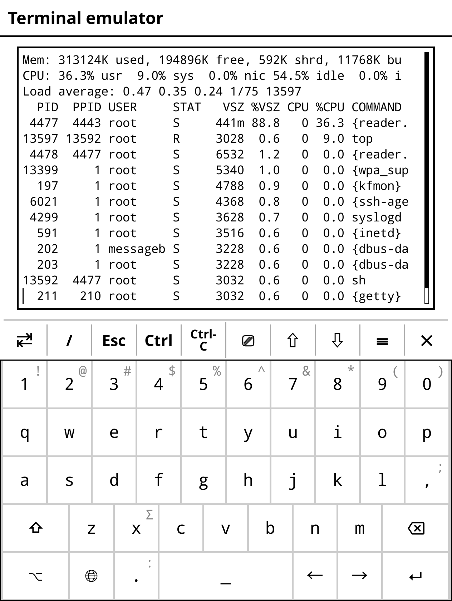

# Back up KOReader book metadata with rsync

For each book, KOReader creates a metadata file that contains book settings, notes, current position, etc. And while you can sync the current position and export notes, it also makes sense to keep a backup of all the important data. To make it easier to manage both the content and metadata, use a dedicated directory on your e-reader. For example, I have the _Library_ directory on my Kobo device. All books are stored there, grouped in subdirectories by language, as follows:

```
Library
  English
  Italiano
  Dansk
```

This way, I can back up everything by syncing the _Library_ directory and its entire contents using rsync. There are two ways to do that.

The simplest approach is to connect the e-reader on a machine that has rsync. I use Linux Mint, so as soon as I plug my Kobo, the system automatically mounts it in _/media/$USER/KOBOeReader_. Then it's a matter of running the appropriate rsync command. For example:

```bash
rsync -avh --delete /media/$USER/KOBOeReader/Library/ /path/to/backup/dir
```

Instead of backing up the data to the local machine, you can push the data to a remote Linux machine via SSH:

```bash
rsync -avhz --delete -P -e "ssh -p 22" /media/$USER/KOBOreader/Library/ user@127.0.0.1:/path/to/backup/dir
```

That's all fine and dandy, but you need a machine with rsync for this approach to work.

A slightly more technical but versatile approach is to install rsync on your reader, so you can run backup operations directly on the device itself. To install rsync on a Kobo device, download and install [Kobo Stuff](https://www.mobileread.com/forums/showthread.php?t=254214). Launch KOReader, open the top bar, switch to **Tools -> More tools -> Terminal emulator**, and tap **Open terminal session**. Run the rsync command that syncs the content of the _Library_ directory to a Linux machine. Here's the command I use to back up the data to a Linux server running on my local network:

```bash
rsync -avhz --delete -P -e "ssh -p 22" /mnt/onboard/Library/ user@127.0.0.1:/path/to/library
```

Instead of laboriously entering long rsync commands using the built-in keyboard, you can speed up the process by adding the desired commands to the _koreader/.ash\_history_ file. Alternatively, you can write a shell script to automate the task. Create a text file named _up.sh_ in the _koreader/scripts/_ and add the following code (adjust the examples as needed):

```bash
#!/bin/sh
rsync -avhz --delete -P -e "ssh -p 22" /mnt/onboard/Library/ USER@127.0.0.1:/path/to/library
rsync -avhz --delete -P -e "ssh -p 22" /mnt/onboard/.adds/koreader/clipboard/ USER@127.0.0.1:/path/to/export
```

Save the file and make it executable using the `chmod +x /koreader/scripts/up.sh` command.

To launch the script in the e-reader, open the terminal emulator and run the `/path/to/koreader/scripts/up.sh` command.

If you happen to use a second e-reader, and you want to download the saved settings and data, all you have to do is to create a shell script that runs the following commands:

```bash
#!/bin/sh
rsync -avhz --delete --no-g --no-o -P -e "ssh -p 22" USER@127.0.0.1:/path/to/library/ /mnt/onboard/Library
rsync -avhz --delete --no-g --no-o -P -e "ssh -p 22" USER@127.0.0.1:/path/to/clipboard/ /mnt/onboard/.adds/koreader/clipboard
```

!!! bug "Sync workaround"
    Running the described rsync-based shell script to download KOReader data doesn't affect the currently opened book. A simple workaround is to open a book that you are not reading and then run the script. I usually open the _KOReader Quickstart Guide_ book, and then run the script.

## Configure passwordless SSH access

Every time you run the scripts described above, you'd be prompted to enter the password twice, which can quickly become a nuisance. To fix this, generate an SSH key pair in KOReader, and add the public key to the list of authorized keys on the remote machine.



To generate an SSH key pair, launch the terminal emulator in KOReader and run the `ssh-keygen` command. Follow the prompts, but skip specifying a passphrase. Run the `cat .ssh/*.pub` command and copy the key. This generates a key pair in the _/usr/local/niluje/usbnet/etc/dot.ssh/_ directory. To make sure that the keys are there, run the `ssh-agent sh -c 'ssh-add; ssh-add -L'` command.

Copy the _/usr/local/niluje/usbnet/etc/dot.ssh/id\_rsa.pub_ file to a Linux machine, and use the command below to add it to the 
_authorized\_keys_ file on the remote server:

```bash
cat id_rsa.pub | ssh USER@127.0.0.1 "mkdir -p ~/.ssh && cat >> ~/.ssh/authorized_keys"
```

From now on you can run the shell scripts (or any commands and actions that require an SSH connection to the remote machine) without password.

## Launch scripts via NickelMenu (Kobo)

Installing KOReader on a Kobo device adds the NickelMenu launcher to the bottom toolbar. By default, the launcher contains only the **KOReader** entry. But you can also define menu entries that you can use to run the custom scripts. For example, you can create a launch entry that executes the _up.sh_ script described above. To do this, create a file called _up_ in the _.adds/nm_ directory, open the file for editing, and add the following menu definition:

```
menu_item : main : Sync up : cmd_spawn : quiet : exec /mnt/onboard/.adds/koreader/scripts/up.sh
```

Save the changes, and you should see the new **Sync up** entry in the NickelMenu launcher. 