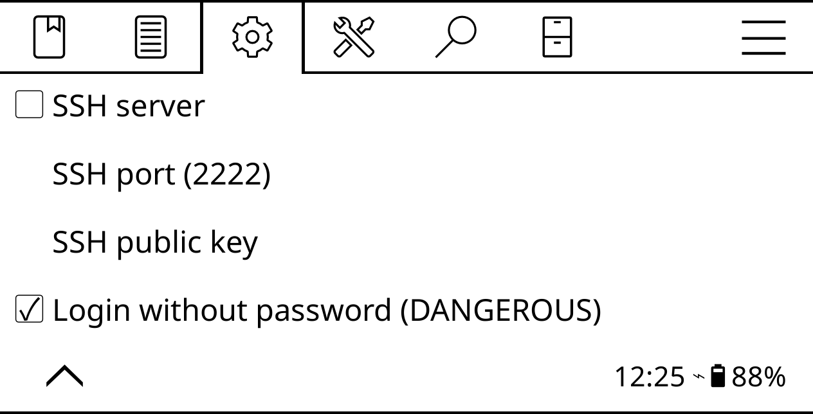

# Connect to the ereader via SSH

In KOReader, open the top bar, switch to **Settings -> Network -> SSH Server**, enable the **Login without password** option, and start the SSH server.



Once the SSH server is running, KOReader displays a dialog with connection information. Note the IP address of the ereader. Using a machine on the same network, establish an SSH connection to the ereader using the following command (replace _127.0.0.1_ with the actual IP address of the ereader):

```bash
ssh -p 2222 root@127.0.0.1
```

Using this feature, you can quickly push books to the ereader wirelessly and without using any additional tools or applications. On most Linux distributions the default file browser can handle the SSH and SFTP protocols. So you can access the ereader's storage by specifying its address in the location bar of the file browser. For example, _ssh://root@127.0.0.1:2222_.

## Add an authorized SSH key

The easiest way to connect to KOReader via SSH is to enable the **Login without password** option. The easiest approach is also the least secure one, as anyone on the same network can get root access to the ereader. So it's a good idea to allow SSH access only to authorized devices. To do this, you need to generate an SSH key pair on the device you want to connect from to your ereader.

To generate an SSH key pair on a Linux machine, run the `ssh-keygen` command in the terminal. Follow the prompts, but skip specifying a passphrase. Run the `cat .ssh/*.pub` command and copy the key.

Connect the ereader to the machine and create the _authorized\_keys_ file in the _koreader/settings/SSH_ directory. Open the file for editing, paste the copied key in it, and save the changes. From now on, you don't have to enter a password when you connect to the ereader from the authorized machine.