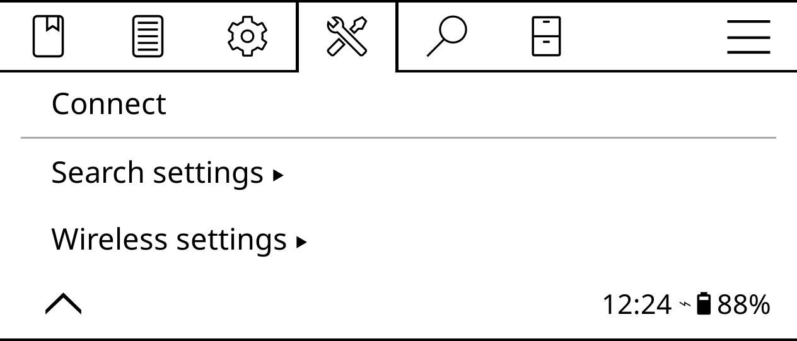

# Send books wirelessly from Calibre

If you happen to use Calibre to manage books on a regular machine, you can access its library from the ereader through Wi-Fi.

1. In Calibre, choose **Connect/Share -> Start wireless device connection**.
2. In KOReader, open the top bar and switch to **Tools -> Calibre**.
3. Choose **Wireless settings -> Enable wireless client**.
4. Return to the **Tools -> Calibre** section, tap **Connect**, then long-tap on the desired folder to set it as the destination directory for files sent from Calibre.
5. Calibre displays a notification when it detects the ereader, and you can then use the **Send to device** button or context menu to push the desired books to the ereader.