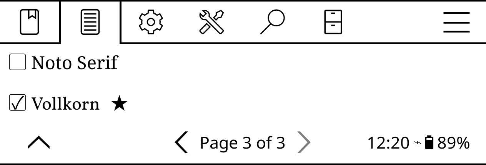

# Add custom fonts

1. Copy a folder with _.ttf_ files to _koreader/fonts_.
2. In KOReader, open the top bar and choose **Document -> Font**.

To set the desired font as the new default, long-tap on it and tap the **Set as default** button.

If you need a high-quality open-source font suitable for reading, try [Vollkorn](http://vollkorn-typeface.com).