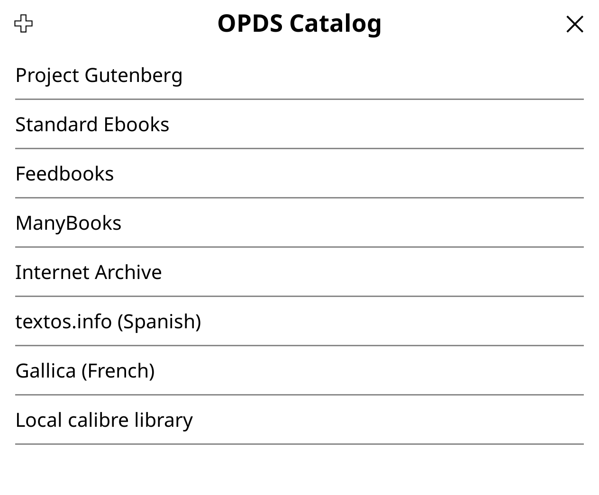

## Access Calibre library via OPDS

Calibre can share the entire library in the OPDS format, which makes it possible to browse and download books using KOReader.

1. In Calibre, choose **Connect/Share -> Start content server** to enable the OPDS catalog.
2. In KOReader, open the top bar and launch the file browser. Tap the top bar in the file browser, and choose **Lookup -> OPDS catalog -> Local calibre library**. You can then browse and download books from the Calibre library.