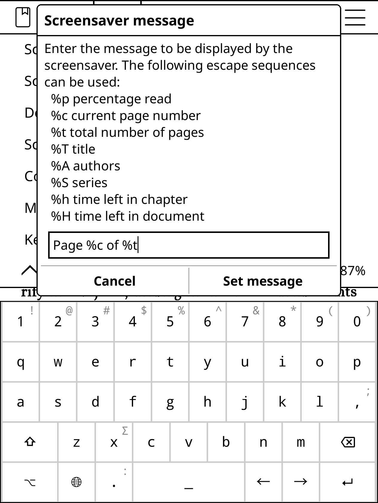

# Set current book cover as screensaver

While an e-ink display doesn't require a screensaver, there is nothing wrong with replacing the plain **Sleeping** message with something more informative. Something like the cover of the current book along with the reading progress.

1. Open the top bar, choose **Settings -> Screen -> Screensaver**, and enable **Use last book's cover as screensaver**.
2. Enable **Add message to screensaver**, then choose **Settings -> Screensaver message**.
3. Specify the _Page %c of %t_ message to show the current and total page count.
