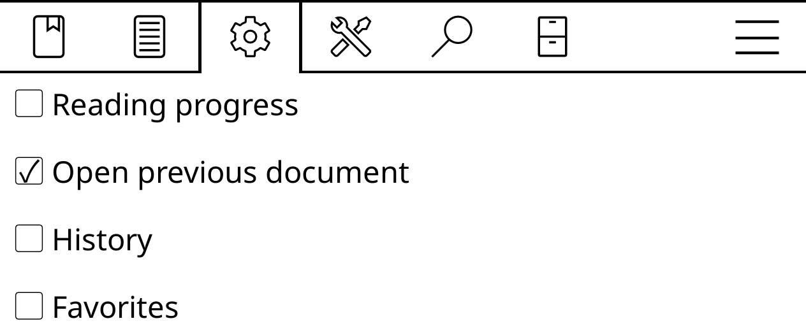

# Switch between two books

If you read two books in parallel, and you frequently switch between them, you can save a few taps by assigning the switch action to the upper-left corner of the screen. To do that, open the top bar and choose **Settings -> Taps and gestures -> Gesture manager -> Tap corner -> Top left -> General** and enable the **Open previous document** option.

You can now switch between two books by tapping on the upper-left corner of the screen. If you prefer to see a list of recent books instead of automatically switching to the latest one, enable the **History** option instead of **Open previous document**. Using the described technique, you can customize the behavior of other corners.